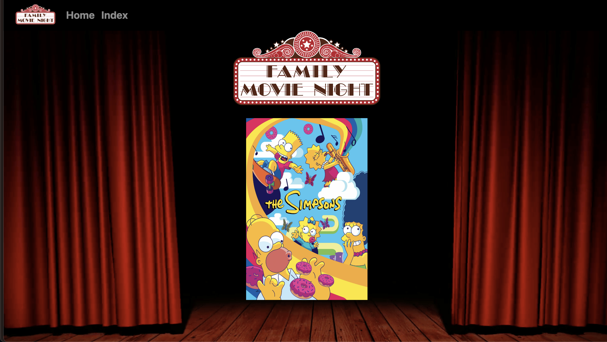
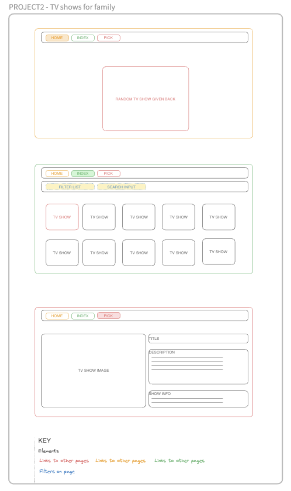

# Project 2 - Family Movie Night


## Description
​The second project is to build a React application that consumes a public API.​
We decided to build a website that would show us TV series and be able to filter them per genre and sort them per alphabetical order or best ratings. The home page displays a random suggestion for a series part of the family genre.

## Deployment link
https://familymovienight.netlify.app/

## Packages to install
```
npm i
npm i sass
npm install react-router-dom localforage match-sorter sort-by
npm install react-bootstrap bootstrap
npm i axios
npm run dev
```

## Timeframe & Working Team
This second project was a pair programming project, I was teamed with Ying Li
It was a mini hackathon project, we had two days to build a React application that consumes a public API

## Technologies Used
ReactDOM from react-dom/client
- The source of the app has several components
react-router-dom 
- Multiple page applications built using loaders to await fetch information from various API
Bootstrap
- Link
- Navbar ( Navbar.Brand, Navbar.Toggle, Navbar.Collapse, Nav, Nav.Link, Container)
- Container, Col, Row
Sass
- Using multiple Sass files that will all be imported into a main.scss file to be compiled
    - In global
        - One for variables that will be used throughout the other scss files
        - One base that is relevant to the styling of all pages
    - In components
        - One scss file per component that will be relevant to a unique jsx component

## Brief
### Technical Requirements
- Consume a public API – this could be anything but it must make sense for your project.
- Have several components
- The app can have a router - with several "pages", this is up to you and if it makes sense for your project.
- Include wireframes - that you designed before building the app.
- Be deployed online and accessible to the public

## Planning
- This was a high-speed project so the planning was shorter than the previous one
- First, we had to come up / agree on an idea and theme of the kind of app we wanted to build
- Second, we tested multiple APIs to see the kind of JSON information they were returning and how accessible it was. We also checked the rate limit of the chosen API and made sure that it had a sufficient limit of calls per IP address
- We then started on the wireframes for each page of the application we intended to build

- After being signed off on the planning above, we started building the app on VScode
- We used live share on VS code to both be able to code along at the same time. 
    -   This was a highly frustrating process, especially for my partner Ying as the original code ran on my machine. Therefore, she couldn't inspect the DOM or access the console logs on the browser. 

## Build/Code Process
### Day 1 afternoon
- Set up the folders and files structure template that will create our multipage app for both components and styles.
- Coded the main.jsx to create our multipage by importing:
    - the relevant node-modules for React;
    - the relevant styles (bootstrap and local .scss);
    - the relevant components;
    - the relevant loaders;
    - then createBrowserRouter where the children of the App will be assigned their specific path, element, loaders.
- Coded a JavaScript file with the appropriate export async functions that are used in main.jsx.
    ```JS
    export async function getTvIndex() {
    const response = await fetch('https://api.tvmaze.com/shows')
    return response.json()
    }
    export async function getTvPick(id) {
    const response = await fetch(`https://api.tvmaze.com/shows/${id}`)
    return response.json()
    }
    export async function getCast(id) {
    const response = await fetch(`https://api.tvmaze.com/shows/${id}/cast`)
    return response.json()
    }
    ```
- We started to code the individual .jsx files in the components where logics, functions and JSX renders are returned
- We implemented the function to filter the TV series, but it was not yet extracting the list of all genres available from the API, it only worked if the genre string was hardcoded in the function
- We created the Navigation bar where the users can access the home page and the index page
- The third page was also created and gave all the information specific to a chosen TV series that we deemed interesting to display on the page
    - All desired information not always exist for each TV series, we, therefore, had to ensure that we didn't display empty field on the page
        ```JS
        <Col md={6} className='single-detail text-left' style={{    backgroundColor: "black" }}>
            <h1 className='bold display-3 mb-4'>{name}</h1>
            <div dangerouslySetInnerHTML={createSummaryMarkup()} />
            <Link to={`/shows/${id}/cast`} style={{ textDecoration: "none" }} className='castButton'><b>See Cast</b></Link>
            {language && (<div><b>Language:</b> {language}</div>)}
            {runtime && (<div><b>Runtime:</b> {runtime} minutes</div>)}
            {average && (<div><b>Rating:</b> {average}</div>)}
            {genres.length > 0 && (<div><b>Genres:</b> {genres.join(' | ')}</div>)}
            {officialSite && (<Link to={officialSite} style={{ textDecoration: "none", color: "white" }}><b style={{ textDecoration: "none", color: "white" }}>Official Site:</b> <span style={{ textDecoration: "underline" }}>{officialSite}</span></Link>)}
        </Col>
        ```

### Day 2
- We implemented the function to display a random movie on the home page
    ```JS
    export default function Home() {
    const shows = useLoaderData()
    const showList = [...new Set(shows)].filter(show => {
    return show.genres.includes("Family")
    }
    )
    const index = Math.floor(Math.random() * showList.length)
    const randomPick = showList[index]
    const image = randomPick.image.original
    const id = randomPick.id
    //!JSX
    return (
    <>
    <div className="movieimg">
        
        <h1 className='text-center bold display-3 mb-4'></h1>
        <Link
            src={image}
            key={id}
            to={`/shows/${id}`}
            >
            
        </Link>
        </div>
    </>
    )
    }
    ```
- We extracted all the genres available in the API and created an array that can be used in the dropped down selection 
    ```JS
    const genresAll = []
    const genreSets = [...new Set(shows.map(show => show.genres))]
    genreSets.forEach(listOfGenre => {
    listOfGenre.forEach(genre => {
        genresAll.push(genre)
        genresAll.unshift('All')
    })
    })
    const genreList = genresAll.filter((value, index) => genresAll.indexOf(value) === index)

    const [genrePick, setGenrePick] = useState('All')
    const [search, setSearch] = useState('')
    const [sortChoice, setSortChoice] = useState('Sort by:')
    ```
    ```JS
    <section className="searchContainer">
        <form onSubmit={handleSubmit}>
            <select
            className="genres-list"
            onChange={(e) => setSortChoice(e.target.value)}
            value={sortChoice}
            >
            {<>
                <option>Sort by:</option>
                <option value={'alphabetical'}>Alphabetical</option>
                <option value={'rating'}>Rating</option>
            </>
            }
            </select>
            <select
            className="genres-list"
            onChange={(e) => setGenrePick(e.target.value)}
            value={genrePick}
            >
            {genreList
                .map((genreChoice, i) => {
                return <option key={i}value={genreChoice}>{genreChoice}</option>
                })
            }
            </select>
            <input
            placeholder="Search..."
            className="search"
            onChange={(e) => setSearch(e.target.value)}
            value={search}
            />
        </form>
        </section>
    ```
- We implemented another search function that would allow the users to search a specific TV series when writing text in the input bar.
- Both filters, a drop-down list of genre and input text work together 
    ```JS
    .filter(show => {
        const pattern = new RegExp(search, 'i')
        if (genrePick === 'All') {
            return pattern.test(show.name)
        } else if (show.genres.includes(genrePick)) {
            return pattern.test(show.name)
        }}
    )
    ```

### Day 3 morning
- We added external links to the official website in the information displayed on the chosen TV series
- We added a fourth page to the app that displays the cast of the chosen TV series, from there if the user clicks on a specific cast member, it would reroute the page to the official website giving further information regarding the actor;
- We also decided to add a sort function to give the choice to the user to either see the TV series alphabetically or by rating
    ```JS
    .sort((a, b) => {
                if (sortChoice === 'rating') {
                    console.log(typeof b.rating.average)
                    return b.rating.average - a.rating.average


                } else if (sortChoice === 'alphabetical') {


                    return a.name.localeCompare(b.name)
                }
                })
    ```
- We spent most of that morning finalising the look and layout of each page.
- We made the index page responsive by using the bootstrap rows and columns and their container behaving fluidly (this was a frustrating part of the process)
- We made the home page look prettier (unfortunately, this one is not responsive as we didn't have time to add media queries to make it look good on mobile devices)

## Challenges
- Filter function was challenging and we asked for help in the evening session with the teaching assistant and she pointed us in the right direction. The instructor also sent us further links on the subject in the morning and we managed to work it out.
- We tried to use Bootstrap for the dropped-down list button. It looked okay on the page but it was not behaving as intended and it didn't give us much flexibility in terms of styling. We felt like we were wrestling with the framework and finally took the decision to standard ```<select>``` and ```<option>``` elements that were behaving as intended and giving us more freedom to style as desired
- The fluid Container from the Bootstrap framework was also a challenge to use. We didn't want the thumbnails to be part of the background image because when we added the information (title and rating) it sometimes overlapping
    ```JS
    .map(show => {
    const { id, name, image: { medium } } = show
    return (
        <Col
        as={Link}
        key={id}
        xs={4}
        s={3}
        md={3}
        lg={2}
        xl={2}
        to={`/shows/${id}`}
        >
        <div className="rails">
            
            <div className="movietittle">
            <p>{name}<br></br>★Rating: {show.rating.average}</p>
            </div>
        </div>
        </Col>
    )})
    ```

## Wins
- We managed to implement all the functionalities that we had planned to build and even more by adding an extra page to the cast and multiple links to external websites. We also added a sort function to give the option to see the index in various order.
- Pair coding was a bit of a challenge, but very useful to see how other mind works. 

## Key Learnings/Takeaways
Extracting information from an API is highly dependent on the quality of the API structure. When deciding the theme for our React web pages we searched various APIs and chose one that we were satisfied with the kind of information available. 

## Bugs
None that we are aware of

## Future Improvements
Make the home page responsive as well 
